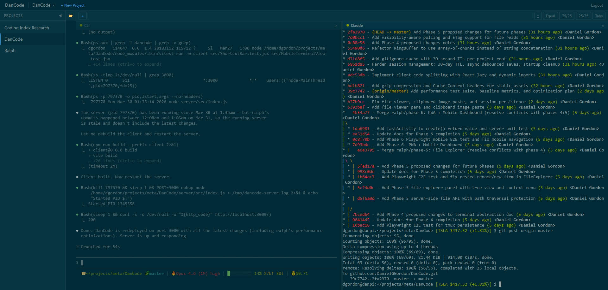

# DanCode

Web-based project terminal manager. Provides browser-based terminal access with direct PTY spawning, letting you manage multiple coding projects from any device on your network.

Built for Raspberry Pi 5, accessed via Tailscale.



## Tech Stack

- **Backend:** Node.js + Express + Socket.io + standalone `dancode-shellhost` (UNIX-socket PTY owner)
- **Frontend:** React + Vite + Tailwind CSS
- **Terminal:** xterm.js + node-pty owned by `dancode-shellhost`
- **Editor:** CodeMirror 6 with per-language packs (JS/TS + JSX/TSX, Python, JSON, Markdown, YAML, Bash via legacy-modes, HTML, CSS)
- **Theme:** Solarized Dark (#002b36)
- **Testing:** Vitest + Playwright + Midscene.js

## Project Structure

See [PROJECT_STRUCTURE.md](PROJECT_STRUCTURE.md) for the full file tree.

The `android/` tree is the in-progress native Android client that will
replace the mobile web path. See [android/README.md](android/README.md)
for the toolchain bootstrap and build commands.

## Prerequisites

- **Node.js** `^20.19.0 || >=22.12.0` (required by Vite 8; use `nvm install` to pick up the `.nvmrc`)

## Getting Started

```bash
npm install              # Install all workspace dependencies
npm run check:setup      # Verify Node version, build deps, socket-dir writability
npm run dev              # Start shellhost + server + client concurrently
```

`npm run dev` listens on `/tmp/dancode-shellhost-dev.sock` so it doesn't collide with a production shellhost on `~/.dancode/shellhost.sock`. Override either with the `DANCODE_SHELLHOST_SOCKET` env var.

## Features

- **Multi-terminal layout** — Split (side-by-side) or tabbed view with dynamic terminal creation, close, and rename
- **Shellhost-backed terminals** — `dancode-shellhost` owns every PTY and writes per-terminal scrollback (`~/.dancode/terminals/<id>/scrollback.log`, 1MB rotating) and metadata (`meta.json`) to disk. The web server is stateless w.r.t. PTYs; restarting it does not disturb running shells
- **Server restart recovery (Phase 3)** — When the web server is killed mid-session, PTYs keep running in shellhost. On restart the server calls shellhost's `list` op, rebuilds its in-memory map, and replays each terminal's on-disk scrollback to reconnecting browsers
- **Shellhost restart recovery (Phase 5)** — When the standalone `dancode-shellhost` is killed (Pi reboot, `systemctl --user restart`, SIGKILL), every terminal's `meta.json` and on-disk scrollback survive. On the next project open the server calls shellhost's `respawn` op, which spawns a fresh PTY at the saved cwd/command and prepends a yellow ANSI banner (`--- prior session ended at <ISO> ---`) to the same `scrollback.log` (appended, not truncated) so history survives across respawns
- **Claude-aware resume (Phase 7)** — Shellhost periodically (5s) inspects each PTY's foreground process via `ps -t <tty>`. When the foreground is `claude` (or `node …/claude.js`), it scans `~/.claude/projects/<slug>/*.jsonl` for the newest session id and persists it to `meta.claudeSessionId`. On respawn after a reboot, if the command is a Claude invocation the spawn rewrites to `claude --resume <id>`, so the conversation continues. A "Resume Claude" button appears on the terminal pane when the recorded session id is present and Claude isn't currently foreground; clicking it types `claude --resume <id>` and presses Enter (dismissible per-terminal). The detection loop runs under a < 1% sustained CPU budget — verified by a 60s integration test
- **Reconnection UX** — Auto-reconnects on disconnect with "Reconnecting..." overlay, 30-second timeout to "Disconnected" with manual button; per-terminal connection state indicator dots (green/yellow/red)
- **Project creation** — Automatically creates 2 terminals (CLI + Claude) per project
- **Drag-and-drop image upload** — Drop images onto a terminal to upload and inject the file path
- **Clipboard image paste** — Ctrl+V a screenshot into a terminal to upload and inject the file path (for sending images to Claude)
- **Clipboard support** over plain HTTP — Ctrl+C copies selected text, Ctrl+V pastes (uses `execCommand` fallback for non-HTTPS)
- **Focused pane indicator** — 8px blue accent bar + dimmed unfocused panes
- **Right-click context menu** on sidebar projects — Rename, Delete
- **Keyboard shortcuts** — Ctrl+K command palette, Alt+arrows project switching, Ctrl+wheel font sizing
- **Per-tab editor zoom** — In any open file editor, `Ctrl/Cmd +`, `Ctrl/Cmd -`, and `Ctrl/Cmd 0` change the font size of that editor only (range 8–32 px, default 14 px). The size is persisted per-project per-file in `localStorage` (key `dancode-zoom-file:<slug>:<filePath>`) and restored across reloads. Other open tabs, the file tree, and the surrounding UI are unaffected; when focus is outside any editor the shortcuts fall through to the browser's native page zoom.
- **PWA installable** — manifest.json with DanCode branding, Solarized Dark theme color (#002b36), standalone display; service worker caches app shell for offline-capable fast loading; installable on Android home screen
- **Mobile terminal** — Full-screen read-first terminal on mobile (<1024px) with thin top bar, keyboard toggle, and horizontal shortcut bar (Ctrl+C/V/D, Tab, arrows, Esc) with 44px tap targets
- **Mobile dashboard** — Project card grid with activity indicators (active/idle), terminal labels, last activity timestamps, pull-to-refresh, long-press quick actions (open CLI/Claude terminal), and visibility-aware polling that pauses when the browser tab is hidden to save battery
- **Mobile navigation** — Three-level flow: dashboard → terminal list → full-screen terminal, with back button at each level
- **Swipe gestures** — Swipe left/right between terminals with dot pagination indicators; swipe from left edge opens project drawer
- **Pinch-to-zoom** — Touch gesture for terminal font size on mobile
- **Tablet support** — Optional side-by-side terminals (768-1024px) with shortcut bar toggle
- **File explorer** — Collapsible tree-view panel with lazy-loaded directories, file type icons, right-click context menu (rename, delete, copy path, new file, new folder, open terminal here, open in viewer), drag files onto terminals to insert paths, .gitignore filtering with toggle, hidden file toggle
- **File editor (Phase 6)** — Click a file in the explorer to open it as a pane alongside terminals. CodeMirror 6 with per-extension language packs (JavaScript/TypeScript with JSX/TSX, Python, JSON, Markdown, YAML, Bash, HTML, CSS; unknown extensions fall back to plain text). Built-in find (Ctrl+F) / replace (Ctrl+H), undo/redo (Ctrl+Z / Ctrl+Y), multi-cursor (Alt+Click, Ctrl+D), always-visible line numbers. Saves explicitly on Ctrl+S and automatically when the editor loses focus, both through `PUT /api/projects/:slug/files/*`. Server-side path safety rejects any write that would escape the project root with 403
- **TOTP authentication** — Username/password + TOTP-based login with QR code setup; sessions persist across server restarts with 30-day TTL, automatic expiry cleanup on startup and hourly, async debounced disk writes
- **Response optimization** — Gzip compression on all HTTP responses; Vite-hashed static assets cached immutably for 1 year, `index.html` served with `no-cache` for instant updates; file read API returns ETag headers (computed from file mtime + size) with `304 Not Modified` support for conditional requests
- **Server I/O optimization** — Gitignore rules cached per project root with 30-second TTL

## Migrating from a pre-shellhost install

If you previously ran DanCode against the legacy tmux backend (sessions named
`dancode-*`), run the one-shot migration script before starting the new
shellhost-based stack:

```bash
node bin/dancode-migrate-from-tmux
```

It captures each tmux session's scrollback and cwd, writes them into
`~/.dancode/terminals/<id>/`, appends the new terminal id to the matching
project's `layout.json`, and kills the source tmux sessions. The script is
idempotent — re-running it after a successful migration prints a trivial
"Migrated 0 terminals" summary and changes nothing.

## Development

```bash
npm run dev          # Server (watch) + Client (HMR) concurrently
npm run build        # Production build (client)
npm test             # Run unit tests (Vitest)
npm run test:e2e     # Run E2E tests (Playwright)
```

## Production install on the Pi

Long-running deployments run `dancode-shellhost` (and optionally
`dancode-server`) as `systemd --user` units. Shellhost owns every PTY, so
having `systemd` supervise it means a Pi reboot brings every terminal back
via Phase 5 respawn semantics — no manual restart, no lost meta.

1. **Install Node 20+ and build tools** (one-time per machine):

   ```bash
   sudo apt install build-essential python3
   curl -fsSL https://deb.nodesource.com/setup_20.x | sudo bash -
   sudo apt install -y nodejs
   ```

2. **Clone the repo + install JS deps**:

   ```bash
   git clone https://github.com/DanielGGordon/DanCode.git /opt/dancode
   cd /opt/dancode
   npm install
   npm run check:setup     # verifies Node, build deps, ~/.dancode is writable
   npm run build           # builds the client into client/dist/
   ```

3. **Install the systemd --user units**:

   ```bash
   bash systemd/install.sh
   ```

   The installer copies `systemd/dancode-shellhost.service` (and, by default,
   `systemd/dancode-server.service`) into `~/.config/systemd/user/`,
   rewrites the `ExecStart=` to your actual repo path, runs
   `systemctl --user daemon-reload`, then `systemctl --user enable --now`.
   Override the repo path with `DANCODE_REPO=/srv/dancode bash
   systemd/install.sh`, or skip the server unit with
   `DANCODE_INSTALL_SERVER=0 bash systemd/install.sh` if you'd rather run
   the web server via `npm run start` under another supervisor.

4. **Enable linger so the units survive logout and a Pi reboot**:

   ```bash
   sudo loginctl enable-linger "$USER"
   ```

5. **Verify with the health-check**:

   ```bash
   node bin/dancode-healthcheck.mjs
   ```

   The script checks: the shellhost socket is reachable, the `list` op
   responds, a throwaway PTY round-trips `echo healthcheck-<uuid>`, and the
   web server's `/api/auth/setup/status` endpoint answers. Non-zero exit
   fails the install.

`systemctl --user status dancode-shellhost` shows live unit state.
`journalctl --user -u dancode-shellhost -f` follows its logs.

### What the unit gives you

- `Type=simple`, `Restart=on-failure` — a SIGSEGV or panicked exit auto-restarts shellhost in ~1s.
- `Environment=DANCODE_SHELLHOST_SOCKET=%h/.dancode/shellhost.sock` — production socket. The dev workflow uses `/tmp/dancode-shellhost-dev.sock` instead so `npm run dev` doesn't fight the systemd-managed prod socket.
- Phase 5 respawn means meta.json + scrollback.log under `~/.dancode/terminals/` survive every restart, so the next project open re-spawns each terminal at its saved cwd/command (plus a yellow "prior session ended at …" banner). Phase 7 rewrites Claude terminals to `claude --resume <session>` on respawn.

### Validating the install pipeline (CI)

`systemd/integration-test/run.sh` builds a privileged `debian:12-slim`
container with systemd as PID 1, performs the README install steps,
SIGKILLs shellhost (asserting auto-restart in < 5s), then drives
stop/start with a pre-spawned terminal to confirm respawn semantics
work end-to-end. CI runs this in lieu of touching a real Pi.
